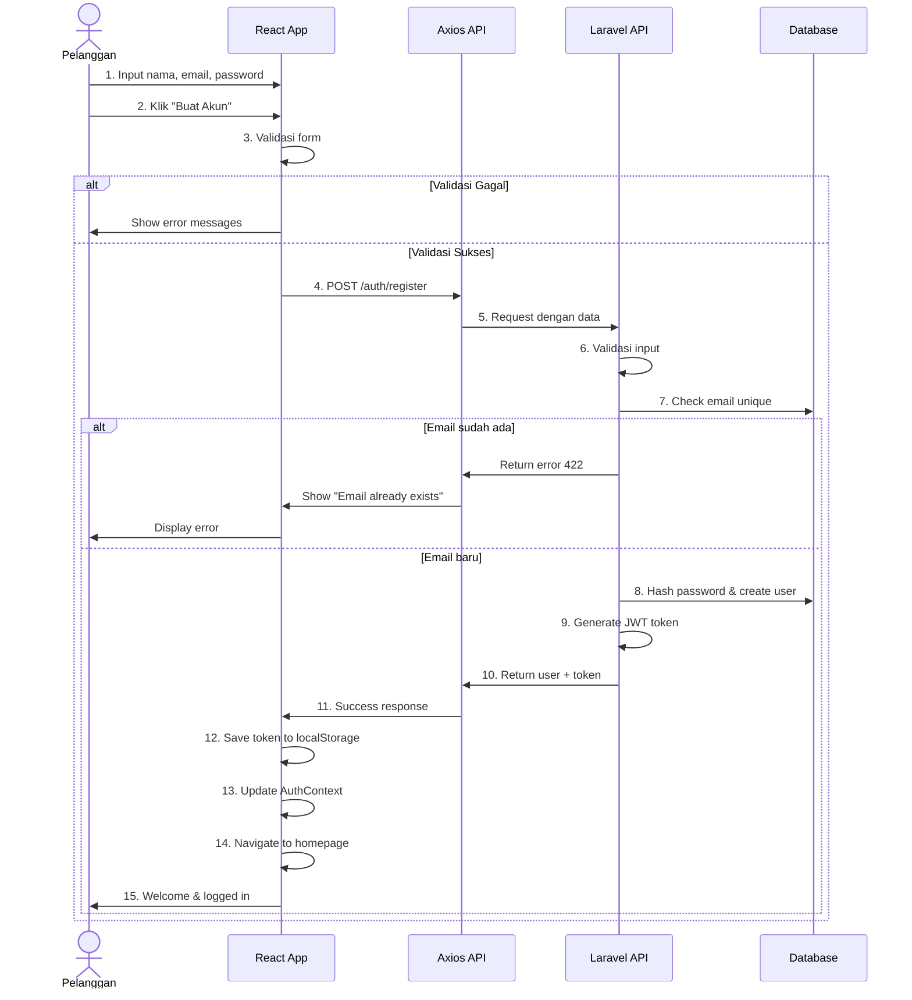
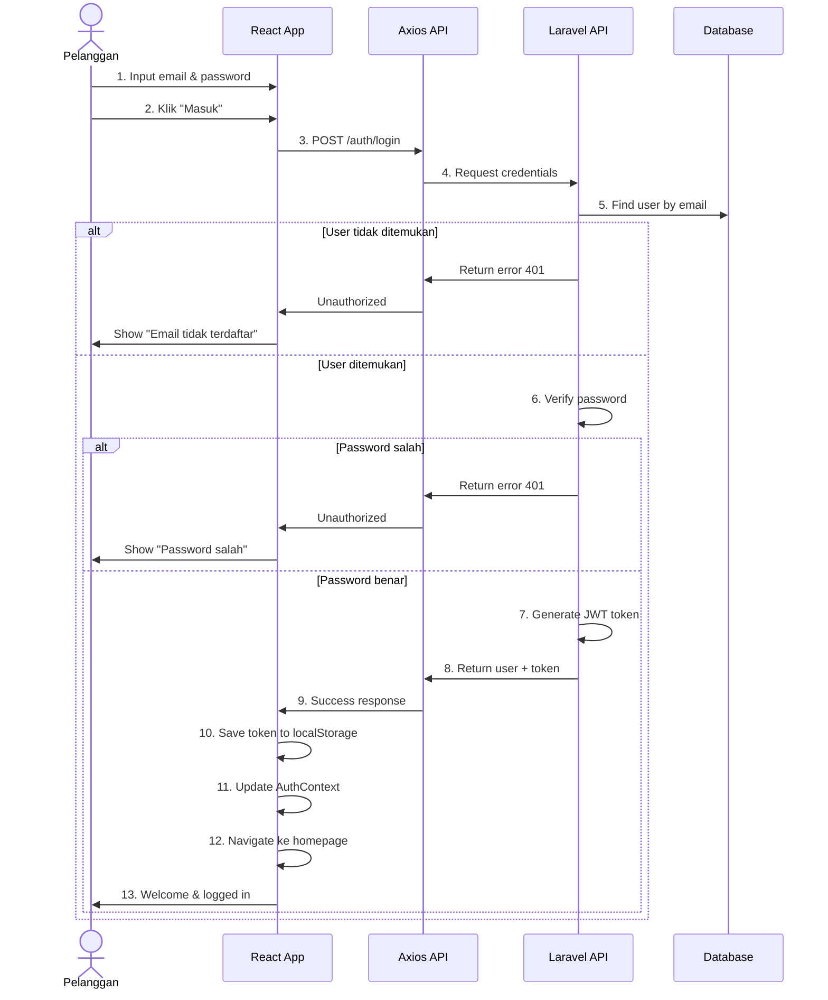
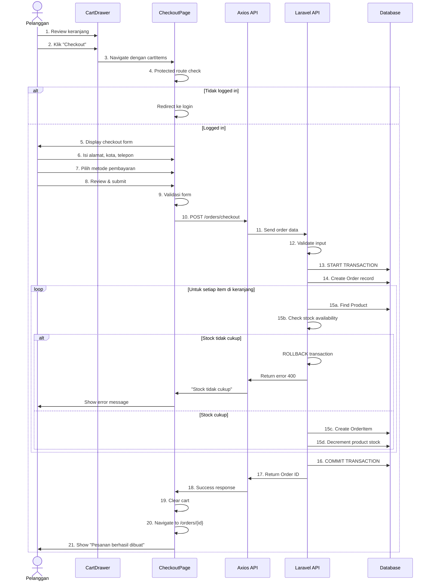
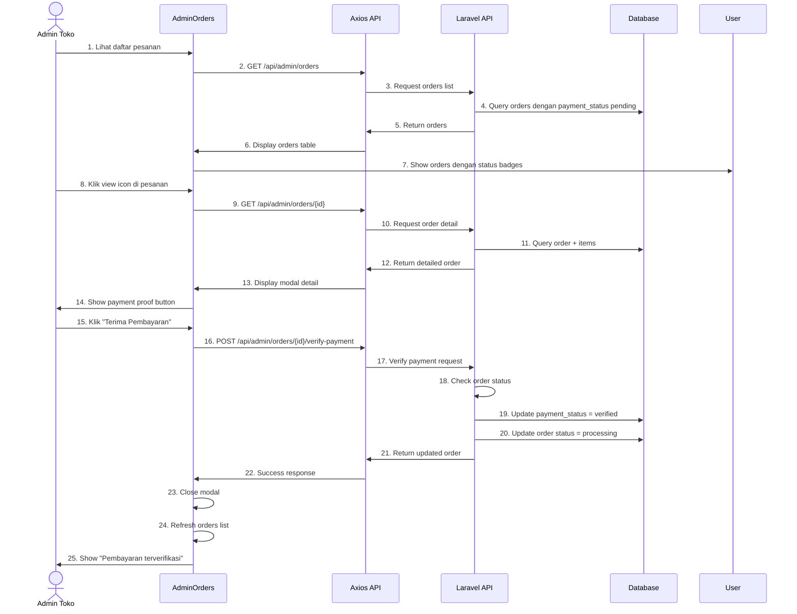
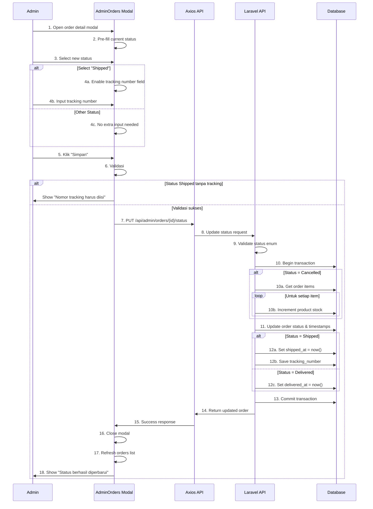
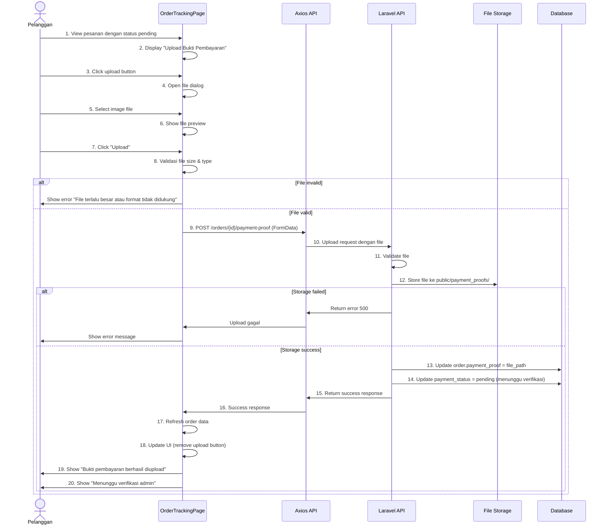
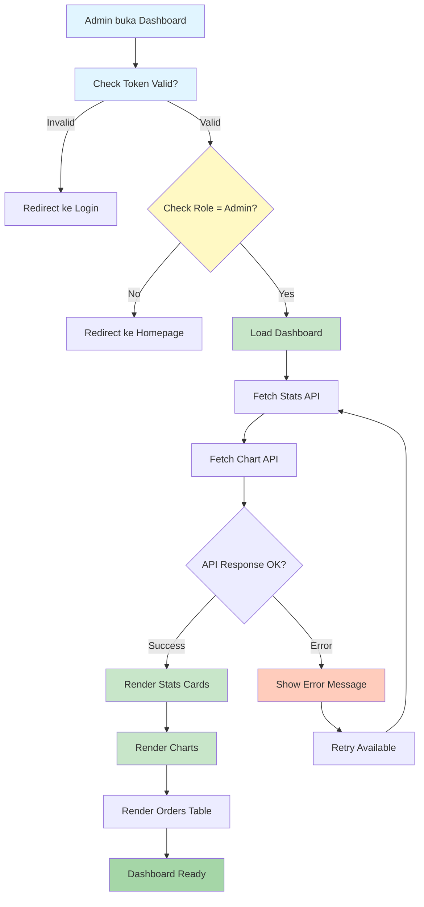
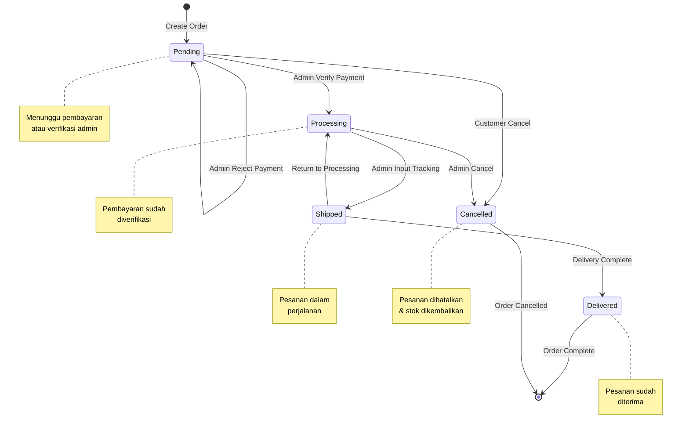

# SEQUENCE DIAGRAMS & DETAILED FLOWS
## Sistem Informasi Toko Pancing Online

---

## 1. SEQUENCE DIAGRAM: REGISTRASI DAN LOGIN

### Registrasi (UC-001)



### Login (UC-002)



---

## 2. SEQUENCE DIAGRAM: CHECKOUT FLOW



---

## 3. SEQUENCE DIAGRAM: PAYMENT VERIFICATION ADMIN



---

## 4. SEQUENCE DIAGRAM: UPDATE STATUS PESANAN



---

## 5. SEQUENCE DIAGRAM: UPLOAD BUKTI PEMBAYARAN



---

## 6. ACTIVITY DIAGRAM: ADMIN DASHBOARD REFRESH



---

## 7. STATE MACHINE: ORDER STATUS FLOW



---

## 8. DATA FLOW DIAGRAM: CHECKOUT PROCESS

```
PELANGGAN
    |
    ├─> Add Products to Cart (Local State)
    |       ├─> Save to CartContext
    |       └─> Update Cart Badge
    |
    ├─> Click Checkout
    |       └─> Verify Auth Token
    |           ├─> Token Valid? → Continue
    |           └─> Token Invalid? → Redirect Login
    |
    ├─> Fill Checkout Form
    |       ├─> Address
    |       ├─> City
    |       ├─> Phone
    |       └─> Payment Method
    |
    └─> Submit Order
            |
            ├─> Frontend Validation
            |   └─> All Fields Required?
            |       ├─> Yes → Send to Backend
            |       └─> No → Show Error
            |
            ├─> Backend Validation
            |   └─> Valid Input?
            |       ├─> Yes → Check Stock
            |       └─> No → Return 422
            |
            ├─> Stock Verification
            |   └─> All Items Available?
            |       ├─> Yes → Create Order
            |       └─> No → Return 400
            |
            ├─> Database Operations (TRANSACTION)
            |   ├─> Insert ORDERS record
            |   ├─> Insert ORDER_ITEMS records
            |   ├─> Decrement PRODUCTS.stock
            |   └─> COMMIT/ROLLBACK
            |
            ├─> Return Order ID
            |
            └─> Redirect to Order Tracking Page
                    └─> Local State: Clear Cart
                    └─> Display Order Status: PENDING
```

---

## 9. FLOW: ADMIN PRODUCT MANAGEMENT (CRUD)

### Create (Tambah Produk)

```
Admin
  ├─> Click "Tambah Produk"
  ├─> Modal Form Opens
  │   ├─ nama_produk (text)
  │   ├─ kategori_id (select)
  │   ├─ harga (number)
  │   ├─ stok (number)
  │   ├─ brand (text)
  │   ├─ lokasi (select: Jakarta, Surabaya, Bandung, Medan)
  │   ├─ deskripsi (textarea)
  │   └─ spesifikasi (JSON/text)
  ├─> Fill Form
  ├─> Click "Simpan"
  ├─> Frontend Validation
  ├─> POST /api/admin/products
  ├─> Backend Validation
  ├─> Insert into PRODUCTS table
  ├─> Return 201 Created
  ├─> Refresh Products List
  └─> Show Success Toast
```

### Read (Lihat List)

```
Admin
  ├─> Click "Produk" Menu
  ├─> GET /api/admin/products
  ├─> Backend Query Products
  ├─> Return paginated data (10 per page)
  ├─> Display Table
  │   ├─ ID | Nama | Brand | Harga | Stok | Lokasi | Actions
  │   └─ Edit / Delete Buttons
  ├─> Display Search Bar
  ├─> Display Pagination Controls
  └─> Display "Tambah Produk" Button
```

### Update (Edit Produk)

```
Admin
  ├─> Click Edit Button on Product Row
  ├─> GET /api/admin/products/{id}
  ├─> Backend Query Product by ID
  ├─> Modal Form Opens with Pre-filled Data
  ├─> Admin Modify Fields
  ├─> Click "Simpan"
  ├─> Frontend Validation
  ├─> PUT /api/admin/products/{id}
  ├─> Backend Validation
  ├─> Update PRODUCTS table
  ├─> Return 200 OK with updated data
  ├─> Refresh Products List
  └─> Show Success Toast
```

### Delete (Hapus Produk)

```
Admin
  ├─> Click Delete Button
  ├─> Confirmation Dialog: "Hapus produk ini?"
  ├─> Click "Ya"
  ├─> DELETE /api/admin/products/{id}
  ├─> Backend Check
  │   └─ Ada order_items yang referensi product ini?
  │       ├─> Yes → Return 400 "Tidak bisa dihapus, ada pesanan"
  │       └─> No → Continue
  ├─> Delete from PRODUCTS table
  ├─> Return 200 OK
  ├─> Refresh Products List
  └─> Show Success Toast
```

---

## 10. RINGKASAN FLOWS

| Flow | Aktor | API Calls | Database Changes | Storage |
|------|-------|-----------|------------------|---------|
| Register | Pelanggan | POST /auth/register | INSERT users | - |
| Login | Pelanggan | POST /auth/login | UPDATE personal_access_tokens | - |
| Browse Products | Anonimous | GET /products | SELECT products | - |
| Filter Products | Anonimous | GET /products?filters | SELECT products | - |
| Add to Cart | Pelanggan | - | - | - (Local State) |
| Checkout | Pelanggan | POST /orders/checkout | INSERT orders,order_items; UPDATE products.stock | - |
| Upload Payment | Pelanggan | POST /orders/{id}/payment-proof | UPDATE orders.payment_proof | File Storage |
| Verify Payment | Admin | POST /admin/orders/{id}/verify-payment | UPDATE orders.payment_status,status | - |
| Update Status | Admin | PUT /admin/orders/{id}/status | UPDATE orders.status + timestamps; UPDATE products.stock (if cancelled) | - |
| Create Product | Admin | POST /admin/products | INSERT products | - |
| Update Product | Admin | PUT /admin/products/{id} | UPDATE products | - |
| Delete Product | Admin | DELETE /admin/products/{id} | DELETE products | - |
| View Dashboard | Admin | GET /admin/dashboard/stats | SELECT (aggregates) | - |

---

**Versi: 1.0**
*Tanggal: 6 April 2026*
*Format: Mermaid Diagrams + ASCII Flow*
