# USE CASE DIAGRAM & IMPLEMENTASI
## Sistem Informasi Toko Pancing Online

---

## 1. USE CASE DIAGRAM (Mermaid Format)

```mermaid
graph TB
    User["👤 Pelanggan"]
    Admin["👨‍💼 Admin"]
    System["🖥️ Sistem Toko Pancing"]
    
    User -->|Register| UC001["UC-001: Registrasi Akun"]
    User -->|Login| UC002["UC-002: Login"]
    User -->|Browse| UC003["UC-003: Lihat Katalog Produk"]
    User -->|Search/Filter| UC004["UC-004: Filter Produk"]
    User -->|View Details| UC005["UC-005: Lihat Detail Produk"]
    User -->|Add| UC006["UC-006: Tambah ke Keranjang"]
    User -->|Manage| UC007["UC-007: Kelola Keranjang"]
    User -->|Purchase| UC008["UC-008: Checkout"]
    User -->|Track| UC009["UC-009: Lacak Pesanan"]
    User -->|Upload| UC010["UC-010: Upload Bukti Pembayaran"]
    User -->|Cancel| UC011["UC-011: Batal Pesanan"]
    User -->|Logout| UC012["UC-012: Logout"]
    
    Admin -->|Login| UC012A["UC-012A: Login Admin"]
    Admin -->|View Analytics| UC013["UC-013: Lihat Dashboard"]
    Admin -->|Manage| UC014["UC-014: Kelola Produk"]
    Admin -->|Manage| UC015["UC-015: Kelola Kategori"]
    Admin -->|Manage| UC016["UC-016: Kelola Pesanan"]
    Admin -->|Verify| UC017["UC-017: Verifikasi Pembayaran"]
    Admin -->|Track| UC018["UC-018: Update Status Pesanan"]
    
    UC001 -.->|includes| UC002
    UC008 -.->|includes| UC007
    UC009 -.->|includes| UC010
    
    UC001 -->|Use| System
    UC002 -->|Use| System
    UC003 -->|Use| System
    UC004 -->|Use| System
    UC005 -->|Use| System
    UC006 -->|Use| System
    UC007 -->|Use| System
    UC008 -->|Use| System
    UC009 -->|Use| System
    UC010 -->|Use| System
    UC011 -->|Use| System
    UC012 -->|Use| System
    UC013 -->|Use| System
    UC014 -->|Use| System
    UC015 -->|Use| System
    UC016 -->|Use| System
    UC017 -->|Use| System
    UC018 -->|Use| System

    style UC001 fill:#e1f5ff
    style UC002 fill:#e1f5ff
    style UC003 fill:#e1f5ff
    style UC004 fill:#e1f5ff
    style UC005 fill:#e1f5ff
    style UC006 fill:#e1f5ff
    style UC007 fill:#e1f5ff
    style UC008 fill:#c8e6c9
    style UC009 fill:#c8e6c9
    style UC010 fill:#c8e6c9
    style UC011 fill:#ffccbc
    style UC012 fill:#f0f4c3
    style UC012A fill:#fff9c4
    style UC013 fill:#f3e5f5
    style UC014 fill:#f3e5f5
    style UC015 fill:#f3e5f5
    style UC016 fill:#f3e5f5
    style UC017 fill:#f3e5f5
    style UC018 fill:#f3e5f5
```



---

## 2. USE CASE NARRATIVE DENGAN KODE IMPLEMENTASI

### UC-001: REGISTRASI AKUN

#### Frontend (React - RegisterPage.jsx)
```jsx
// Handler untuk submit register
const handleSubmit = async (e) => {
  e.preventDefault();
  setErrors({});

  // Validasi
  if (!name) setErrors((prev) => ({ ...prev, name: 'Nama diperlukan' }));
  if (!email) setErrors((prev) => ({ ...prev, email: 'Email diperlukan' }));
  if (!password) setErrors((prev) => ({ ...prev, password: 'Password diperlukan' }));
  if (password !== confirmPassword) {
    setErrors((prev) => ({ ...prev, confirmPassword: 'Password tidak cocok' }));
  }

  if (!name || !email || !password || password !== confirmPassword) return;

  try {
    // Call API untuk register
    const response = await authAPI.register({ name, email, password });
    
    // Simpan token
    localStorage.setItem('authToken', response.data.token);
    
    // Update context
    setUser(response.data.user);
    setToken(response.data.token);
    
    // Redirect ke homepage
    navigate('/');
  } catch (err) {
    const message = err.response?.data?.message || 'Registrasi gagal';
    setError(message);
  }
};
```

#### Backend (Laravel - AuthController.php)
```php
public function register(Request $request)
{
    // Validasi input
    $validated = $request->validate([
        'name' => 'required|string|max:255',
        'email' => 'required|email|unique:users',
        'password' => 'required|string|min:8|confirmed',
    ]);

    // Hash password
    $validated['password'] = Hash::make($validated['password']);
    
    // Set role default ke user
    $validated['role'] = 'user';

    // Create user
    $user = User::create($validated);

    // Generate token
    $token = $user->createToken('auth_token')->plainTextToken;

    return response()->json([
        'message' => 'Register berhasil',
        'user' => $user,
        'token' => $token,
    ], 201);
}
```

#### API Service (api.js)
```javascript
export const authAPI = {
  register: (data) => api.post('/auth/register', data),
  login: (data) => api.post('/auth/login', data),
  getCurrentUser: () => api.get('/auth/user'),
  logout: () => api.post('/auth/logout'),
};
```

---

### UC-002: LOGIN

#### Frontend (React - LoginPage.jsx)
```jsx
const handleSubmit = async (e) => {
  e.preventDefault();
  setErrors({});

  if (!email) setErrors((prev) => ({ ...prev, email: 'Email diperlukan' }));
  if (!password) setErrors((prev) => ({ ...prev, password: 'Password diperlukan' }));
  if (!email || !password) return;

  try {
    // Call API login
    const response = await authAPI.login({ email, password });
    
    // Simpan token
    localStorage.setItem('authToken', response.data.token);
    
    // Update auth context
    setUser(response.data.user);
    setToken(response.data.token);
    
    // Redirect ke homepage
    navigate('/');
  } catch (err) {
    const message = err.response?.data?.message || 'Login gagal';
    setError(message);
  }
};
```

#### Backend (Laravel - AuthController.php)
```php
public function login(Request $request)
{
    // Validasi
    $validated = $request->validate([
        'email' => 'required|email',
        'password' => 'required|string',
    ]);

    // Check user exists
    $user = User::where('email', $validated['email'])->first();

    if (!$user || !Hash::check($validated['password'], $user->password)) {
        return response()->json([
            'message' => 'Email atau password salah'
        ], 401);
    }

    // Generate token
    $token = $user->createToken('auth_token')->plainTextToken;

    return response()->json([
        'message' => 'Login berhasil',
        'user' => $user,
        'token' => $token,
    ]);
}
```

---

### UC-003 & UC-004: LIHAT KATALOG & FILTER PRODUK

#### Frontend (React - HomePage.jsx)
```jsx
const handleFilterChange = async (filters) => {
  setCurrentFilters(filters);
  setLoading(true);
  
  try {
    // Prepare API params
    const params = {};
    if (filters.search) params.search = filters.search;
    if (filters.category) params.category = filters.category;
    if (filters.brand) params.brand = filters.brand;
    if (filters.min_price) params.min_price = filters.min_price;
    if (filters.max_price) params.max_price = filters.max_price;
    if (filters.in_stock) params.in_stock = 'true';
    if (filters.location.length > 0) params.location = filters.location;

    // Call API dengan filter
    const response = await productsAPI.getAll(params);
    setFilteredProducts(response.data.data || products);
  } catch (err) {
    console.error('Filter error:', err);
    setFilteredProducts(products);
  } finally {
    setLoading(false);
  }
};
```

#### Backend (Laravel - ProductController.php)
```php
public function index(Request $request)
{
    $query = Product::query();

    // Search by name
    if ($request->has('search')) {
        $search = $request->input('search');
        $query->where('name', 'like', "%{$search}%");
    }

    // Filter by category
    if ($request->has('category')) {
        $query->where('category_id', $request->input('category'));
    }

    // Filter by brand
    if ($request->has('brand')) {
        $query->where('brand', $request->input('brand'));
    }

    // Filter by price range
    if ($request->has('min_price')) {
        $query->where('price', '>=', $request->input('min_price'));
    }
    if ($request->has('max_price')) {
        $query->where('price', '<=', $request->input('max_price'));
    }

    // Filter by location
    if ($request->has('location')) {
        $locations = $request->input('location');
        $query->whereIn('location', is_array($locations) ? $locations : [$locations]);
    }

    // Filter in stock only
    if ($request->has('in_stock') && $request->input('in_stock') == 'true') {
        $query->where('stock', '>', 0);
    }

    // Pagination
    $products = $query->paginate(10);

    return response()->json([
        'message' => 'Produk berhasil diambil',
        'data' => $products->items(),
        'pagination' => [
            'current_page' => $products->currentPage(),
            'total' => $products->total(),
            'per_page' => $products->perPage(),
        ]
    ]);
}
```

---

### UC-006: TAMBAH KE KERANJANG

#### Frontend (React - CartContext.jsx)
```jsx
const addToCart = (product) => {
  setCartItems((prevItems) => {
    // Check if product already in cart
    const existingItem = prevItems.find((item) => item.id === product.id);
    
    if (existingItem) {
      // Increase quantity
      return prevItems.map((item) =>
        item.id === product.id
          ? { ...item, quantity: item.quantity + 1 }
          : item
      );
    } else {
      // Add new item
      return [...prevItems, { ...product, quantity: 1 }];
    }
  });

  // Calculate total price
  calculateTotal([...cartItems, product]);
};

const calculateTotal = (items) => {
  const total = items.reduce((sum, item) => sum + (item.price * item.quantity), 0);
  setTotalPrice(total);
  setCartCount(items.length);
};
```

#### Frontend Component (CartDrawer.jsx)
```jsx
export default function CartDrawer({ 
  isOpen, 
  onClose, 
  cartItems, 
  updateQuantity, 
  removeFromCart, 
  totalPrice 
}) {
  return (
    <div className={`fixed right-0 top-0 w-96 h-screen bg-white shadow-lg transform transition-transform ${isOpen ? 'translate-x-0' : 'translate-x-full'}`}>
      <div className="p-6 space-y-4">
        <div className="flex justify-between items-center">
          <h2 className="text-2xl font-bold">Keranjang</h2>
          <button onClick={onClose} className="text-gray-500 hover:text-gray-700">×</button>
        </div>

        {cartItems.length === 0 ? (
          <p className="text-gray-500">Keranjang kosong</p>
        ) : (
          <>
            <div className="space-y-3 max-h-96 overflow-y-auto">
              {cartItems.map((item) => (
                <div key={item.id} className="flex gap-3 border-b pb-3">
                  <div className="flex-1">
                    <h3 className="font-semibold">{item.name}</h3>
                    <p className="text-sm text-gray-600">Rp{item.price.toLocaleString('id-ID')}</p>
                  </div>
                  <div className="flex items-center gap-2">
                    <button onClick={() => updateQuantity(item.id, item.quantity - 1)}>-</button>
                    <span>{item.quantity}</span>
                    <button onClick={() => updateQuantity(item.id, item.quantity + 1)}>+</button>
                  </div>
                  <button onClick={() => removeFromCart(item.id)} className="text-red-600">🗑️</button>
                </div>
              ))}
            </div>

            <div className="border-t pt-4">
              <div className="flex justify-between mb-4">
                <span>Total:</span>
                <span className="font-bold text-lg">Rp{totalPrice.toLocaleString('id-ID')}</span>
              </div>
              <Link to="/checkout" className="w-full bg-green-600 text-white py-2 rounded-lg hover:bg-green-700">
                Checkout
              </Link>
            </div>
          </>
        )}
      </div>
    </div>
  );
}
```

---

### UC-008: CHECKOUT

#### Frontend (React - CheckoutPage.jsx)
```jsx
const handleCheckout = async (e) => {
  e.preventDefault();
  setLoading(true);

  try {
    // Prepare order data
    const orderData = {
      items: cartItems.map(item => ({
        product_id: item.id,
        quantity: item.quantity,
        price: item.price
      })),
      total_price: totalPrice,
      shipping_address: formData.address,
      shipping_city: formData.city,
      shipping_phone: formData.phone,
      payment_method: formData.paymentMethod,
    };

    // Call checkout API
    const response = await ordersAPI.checkout(orderData);

    // Get order ID
    const orderId = response.data.data.id;

    // Clear cart
    clearCart();

    // Redirect to order tracking
    navigate(`/orders/${orderId}`);
  } catch (err) {
    setError(err.response?.data?.message || 'Checkout gagal');
  } finally {
    setLoading(false);
  }
};
```

#### Backend (Laravel - OrderController.php)
```php
public function checkout(Request $request)
{
    // Validasi input
    $validated = $request->validate([
        'items' => 'required|array',
        'items.*.product_id' => 'required|exists:products,id',
        'items.*.quantity' => 'required|integer|min:1',
        'total_price' => 'required|numeric|min:0',
        'shipping_address' => 'required|string',
        'shipping_city' => 'required|string',
        'shipping_phone' => 'required|string',
        'payment_method' => 'required|in:bank_transfer,e_wallet',
    ]);

    try {
        // Start transaction
        DB::beginTransaction();

        // Create order
        $order = Order::create([
            'user_id' => auth()->id(),
            'total_price' => $validated['total_price'],
            'status' => 'pending',
            'payment_method' => $validated['payment_method'],
            'payment_status' => 'pending',
            'shipping_address' => $validated['shipping_address'],
            'shipping_city' => $validated['shipping_city'],
            'shipping_phone' => $validated['shipping_phone'],
        ]);

        // Create order items & decrement stock
        foreach ($validated['items'] as $item) {
            $product = Product::findOrFail($item['product_id']);

            // Check stock availability
            if ($product->stock < $item['quantity']) {
                throw new Exception("Stok tidak cukup untuk {$product->name}");
            }

            // Create order item
            OrderItem::create([
                'order_id' => $order->id,
                'product_id' => $product->id,
                'quantity' => $item['quantity'],
                'price' => $product->price,
            ]);

            // Decrement stock
            $product->decrement('stock', $item['quantity']);
        }

        DB::commit();

        return response()->json([
            'message' => 'Checkout berhasil',
            'data' => $order,
        ], 201);

    } catch (Exception $e) {
        DB::rollBack();
        return response()->json([
            'message' => 'Checkout gagal: ' . $e->getMessage()
        ], 400);
    }
}
```

---

### UC-009 & UC-010: LACAK PESANAN & UPLOAD BUKTI PEMBAYARAN

#### Frontend (React - OrderTrackingPage.jsx)
```jsx
const handleUploadPayment = async (file) => {
  try {
    setLoading(true);
    await ordersAPI.uploadPaymentProof(orderId, file);
    
    // Refresh order data
    fetchOrder();
    
    // Show success message
    setSuccess('Bukti pembayaran berhasil diupload. Menunggu verifikasi admin...');
  } catch (err) {
    setError(err.response?.data?.message || 'Upload gagal');
  } finally {
    setLoading(false);
  }
};
```

#### Backend (Laravel - OrderController.php)
```php
public function uploadPaymentProof(Request $request, $id)
{
    // Validasi file
    $validated = $request->validate([
        'payment_proof' => 'required|image|max:5120', // 5MB
    ]);

    $order = Order::findOrFail($id);

    // Check status
    if ($order->status !== 'pending') {
        return response()->json([
            'message' => 'Hanya pesanan dengan status pending yang bisa upload bukti'
        ], 400);
    }

    // Store file
    $path = $request->file('payment_proof')->store('payment_proofs', 'public');

    // Update order
    $order->update([
        'payment_proof' => $path,
        'payment_status' => 'pending', // Waiting for admin verification
    ]);

    return response()->json([
        'message' => 'Bukti pembayaran berhasil diupload',
        'data' => $order,
    ]);
}
```

---

### UC-013: ADMIN DASHBOARD

#### Frontend (React - AdminDashboard.jsx)
```jsx
useEffect(() => {
  fetchDashboardData();
}, []);

const fetchDashboardData = async () => {
  try {
    setLoading(true);
    
    // Fetch stats dan chart data
    const [statsRes, chartRes] = await Promise.all([
      adminAPI.getDashboardStats(),
      adminAPI.getSalesChart({ period: 'daily' })
    ]);

    setStats(statsRes.data.data);
    setChartData(chartRes.data.data);
  } catch (err) {
    console.error('Failed to fetch dashboard data:', err);
    setError(err.response?.data?.message || 'Gagal memuat data dashboard');
  } finally {
    setLoading(false);
  }
};
```

#### Backend (Laravel - Admin/DashboardController.php)
```php
public function getStats()
{
    $totalSales = OrderItem::sum('quantity');
    $totalOrders = Order::count();
    $pendingPayment = Order::where('payment_status', 'pending')->count();
    $totalProducts = Product::count();
    $lowStockProducts = Product::where('stock', '<', 10)->count();

    // Revenue by status
    $revenueByStatus = Order::selectRaw('status, SUM(total_price) as revenue')
        ->groupBy('status')
        ->pluck('revenue', 'status');

    // Recent orders
    $recentOrders = Order::with('user')
        ->latest()
        ->limit(5)
        ->get()
        ->map(function ($order) {
            return [
                'id' => $order->id,
                'user_name' => $order->user->name,
                'total_price' => $order->total_price,
                'status' => $order->status,
                'created_at' => $order->created_at,
            ];
        });

    return response()->json([
        'data' => [
            'total_sales' => $totalSales,
            'total_orders' => $totalOrders,
            'pending_payment' => $pendingPayment,
            'total_products' => $totalProducts,
            'low_stock_products' => $lowStockProducts,
            'revenue_by_status' => $revenueByStatus,
            'recent_orders' => $recentOrders,
        ]
    ]);
}

public function getSalesChart(Request $request)
{
    $period = $request->input('period', 'daily');
    $query = Order::selectRaw('DATE(created_at) as date, SUM(total_price) as total');

    if ($period === 'weekly') {
        $query = Order::selectRaw('WEEK(created_at) as week, SUM(total_price) as total');
    } elseif ($period === 'monthly') {
        $query = Order::selectRaw('MONTH(created_at) as month, SUM(total_price) as total');
    }

    $data = $query->groupBy(
        $period === 'daily' ? 'date' : ($period === 'weekly' ? 'week' : 'month')
    )->get();

    return response()->json([
        'data' => $data,
        'period' => $period
    ]);
}
```

---

### UC-016 & UC-017: KELOLA PESANAN & VERIFIKASI PEMBAYARAN

#### Frontend (React - AdminOrders.jsx)
```jsx
const handleVerifyPayment = async (orderId) => {
  try {
    await adminAPI.verifyPayment(orderId);
    fetchOrders();
    alert('Pembayaran terverifikasi');
  } catch (err) {
    alert(err.response?.data?.message || 'Gagal verifikasi pembayaran');
  }
};

const handleUpdateStatus = async (orderId) => {
  try {
    await adminAPI.updateOrderStatus(orderId, {
      status: updateForm.status,
      tracking_number: updateForm.tracking_number
    });
    fetchOrders();
    setSelectedOrder(null);
    alert('Pesanan diperbarui');
  } catch (err) {
    alert(err.response?.data?.message || 'Gagal memperbarui pesanan');
  }
};
```

#### Backend (Laravel - Admin/OrderController.php)
```php
public function verifyPayment($id)
{
    $order = Order::findOrFail($id);

    if ($order->payment_status !== 'pending') {
        return response()->json([
            'message' => 'Pembayaran sudah diverifikasi sebelumnya'
        ], 400);
    }

    // Update payment status
    $order->update([
        'payment_status' => 'verified',
        'status' => 'processing', // Auto move to processing
    ]);

    return response()->json([
        'message' => 'Pembayaran berhasil diverifikasi',
        'data' => $order,
    ]);
}

public function updateStatus(Request $request, $id)
{
    $validated = $request->validate([
        'status' => 'required|in:pending,processing,shipped,delivered,cancelled',
        'tracking_number' => 'nullable|string',
    ]);

    $order = Order::findOrFail($id);

    // Validasi: jika shipped, harus ada tracking_number
    if ($validated['status'] === 'shipped' && !$validated['tracking_number']) {
        return response()->json([
            'message' => 'Nomor tracking harus diisi untuk status shipped'
        ], 422);
    }

    $updateData = ['status' => $validated['status']];

    // Set timestamps untuk shipped & delivered
    if ($validated['status'] === 'shipped') {
        $updateData['shipped_at'] = now();
        $updateData['tracking_number'] = $validated['tracking_number'];
    } elseif ($validated['status'] === 'delivered') {
        $updateData['delivered_at'] = now();
    }

    // Handle cancelled status
    if ($validated['status'] === 'cancelled') {
        // Restore stock
        foreach ($order->orderItems as $item) {
            $item->product->increment('stock', $item->quantity);
        }
    }

    $order->update($updateData);

    return response()->json([
        'message' => 'Status pesanan berhasil diperbarui',
        'data' => $order,
    ]);
}
```

---

## 3. USE CASE INTERACTION FLOW

### Flow: UC-008 (Checkout) - Diagram Interaksi

```
┌──────────────┐         ┌─────────────────┐         ┌──────────────┐
│   Pelanggan  │         │   Frontend      │         │   Backend    │
└──────┬───────┘         └────────┬────────┘         └──────┬───────┘
       │                         │                         │
       │  1. Klik Checkout       │                         │
       ├────────────────────────>│                         │
       │                         │                         │
       │  2. Tampilkan Form      │                         │
       │<────────────────────────┤                         │
       │                         │                         │
       │  3. Isi & Submit Form   │                         │
       ├────────────────────────>│                         │
       │                         │                         │
       │                         │  4. POST /checkout     │
       │                         ├────────────────────────>│
       │                         │                         │
       │                         │  5. Validasi Data      │
       │                         │<────────────────────────┤
       │                         │                         │
       │                         │  6. Create Order       │
       │                         │     & OrderItems       │
       │                         │<────────────────────────┤
       │                         │                         │
       │                         │  7. Decrement Stock    │
       │                         │<────────────────────────┤
       │                         │                         │
       │                         │  8. Return Order ID    │
       │                         │<────────────────────────┤
       │                         │                         │
       │  9. Redirect ke         │                         │
       │     Tracking Page       │                         │
       │<────────────────────────┤                         │
       │                         │                         │
       │  10. View Order Status  │                         │
       │                         │                         │
```

---

## 4. ERROR HANDLING USE CASES

### UC-E01: Stock Tidak Cukup saat Checkout

```javascript
// Frontend
try {
  await ordersAPI.checkout(orderData);
} catch (err) {
  if (err.response?.status === 400) {
    // Parse error message: "Stok tidak cukup untuk [product name]"
    setError(err.response.data.message);
    // Optionally: redirect ke cart untuk adjust quantities
  }
}
```

```php
// Backend
if ($product->stock < $item['quantity']) {
    throw new Exception("Stok tidak cukup untuk {$product->name}");
}
```

### UC-E02: Email Duplicate saat Register

```javascript
// Frontend - Shows field-specific error
{errors.email && <p className="text-red-600">{errors.email}</p>}
```

```php
// Backend
'email' => 'required|email|unique:users' // Laravel built-in validation
```

### UC-E03: Unauthorized Access ke Admin Panel

```javascript
// Frontend - ProtectedAdminRoute component
function ProtectedAdminRoute({ children }) {
  const { token, user } = useAuth();
  if (!token) return <Navigate to="/login" />;
  if (user?.role !== 'admin') return <Navigate to="/" />;
  return children;
}
```

```php
// Backend - IsAdmin Middleware
class IsAdmin
{
    public function handle(Request $request, Closure $next)
    {
        if (auth()->user()?->role !== 'admin') {
            return response()->json(['message' => 'Unauthorized'], 403);
        }
        return $next($request);
    }
}
```

---

## 5. RINGKASAN IMPLEMENTASI

| Use Case | Frontend | Backend | Database |
|----------|----------|---------|----------|
| UC-001 | RegisterPage.jsx | AuthController::register | users table |
| UC-002 | LoginPage.jsx | AuthController::login | users table |
| UC-003/004 | HomePage.jsx | ProductController::index | products table |
| UC-005 | ProductCard.jsx | ProductController::show | products table |
| UC-006 | CartDrawer.jsx | CartContext (local state) | - |
| UC-007 | CartDrawer.jsx | CartContext (local state) | - |
| UC-008 | CheckoutPage.jsx | OrderController::checkout | orders, order_items, products |
| UC-009 | OrderTrackingPage.jsx | OrderController::show | orders, order_items |
| UC-010 | OrderTrackingPage.jsx | OrderController::uploadPaymentProof | orders |
| UC-011 | OrderTrackingPage.jsx | OrderController::cancel | orders, products |
| UC-012 | Navbar.jsx | AuthController::logout | personal_access_tokens |
| UC-013 | AdminDashboard.jsx | DashboardController::getStats | orders, order_items, products |
| UC-016 | AdminOrders.jsx | AdminOrderController::index | orders, order_items |
| UC-017 | AdminOrders.jsx | AdminOrderController::verifyPayment | orders |
| UC-018 | AdminOrders.jsx | AdminOrderController::updateStatus | orders |

---

**Versi: 1.0**
*Tanggal: 6 April 2026*
